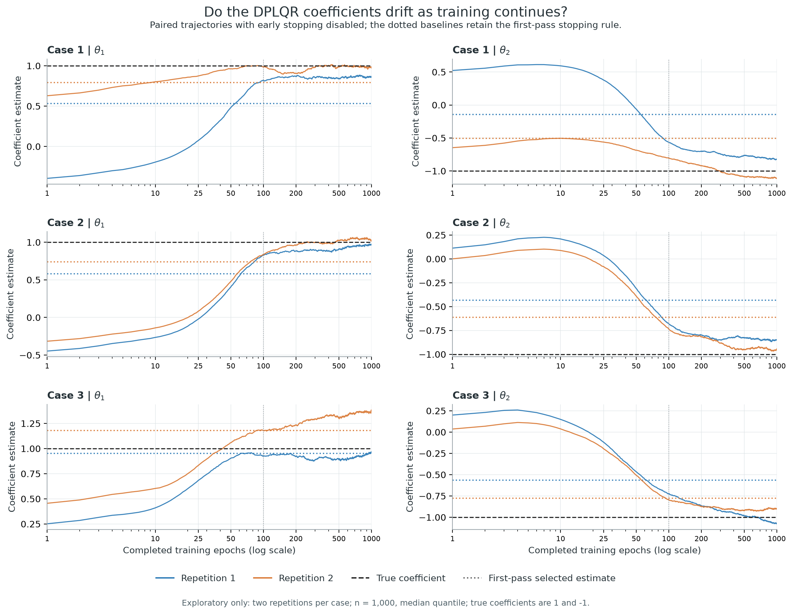
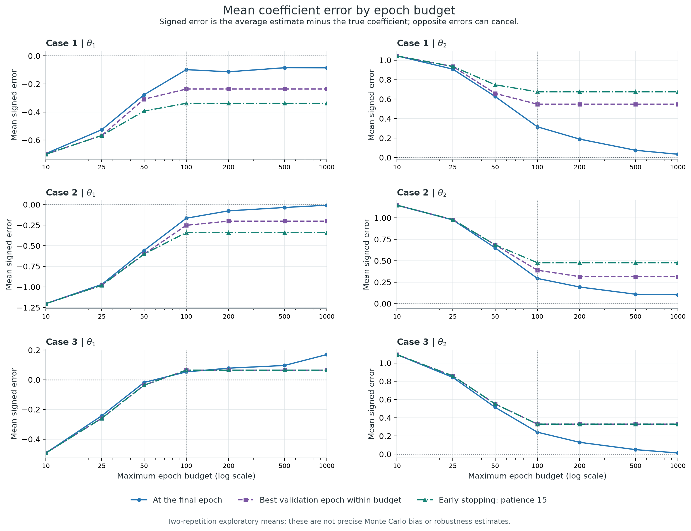
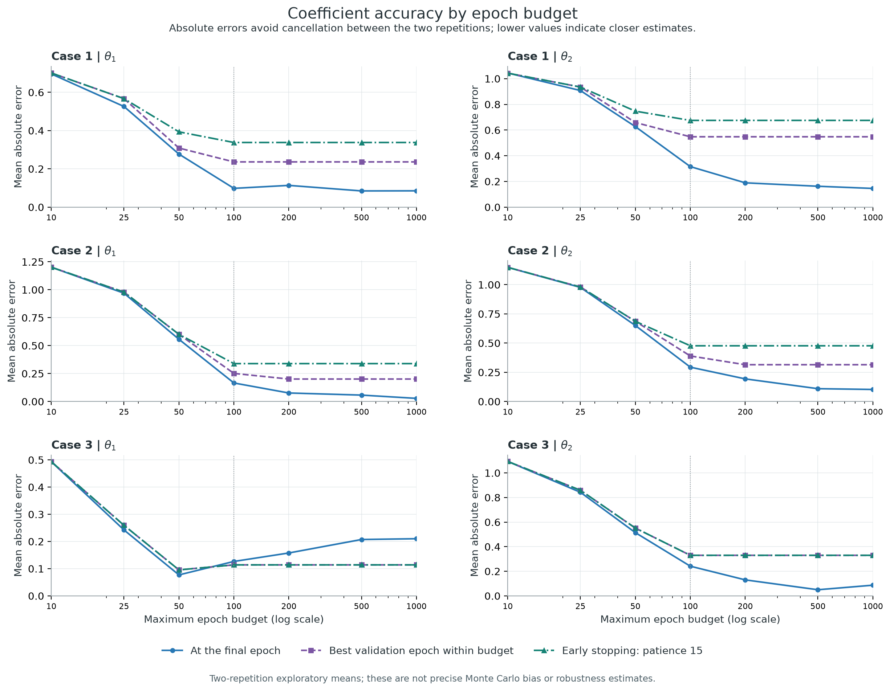
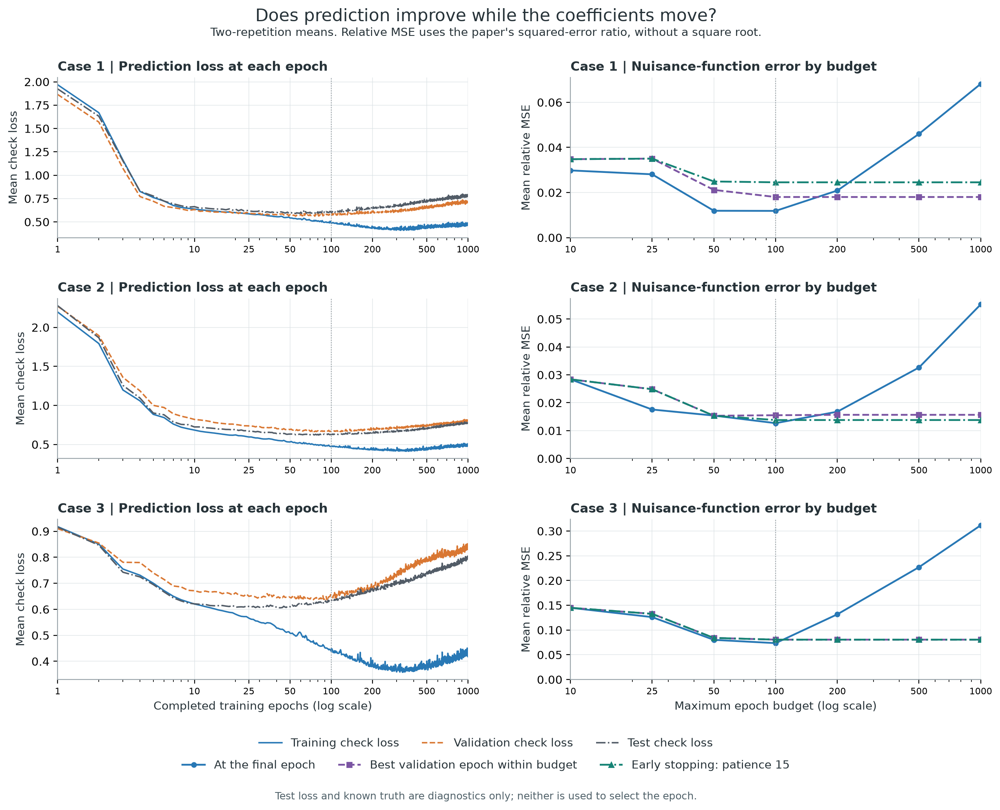

# DPLQR epoch experiment: first-pass results

Created 08 September 2026 (08092026).

Six paired trajectories through 1000 epochs completed in 155.3 seconds. Cases 1–3, n=1000, tau=0.5, two repetitions. The parent first-pass/full-replication settings are unchanged.

## Findings

Between terminal epochs 100 and 1000, absolute theta1 error increased in **2/6** datasets and absolute theta2 error increased in **0/6**. Signed errors can cancel across repetitions; use the individual paths and absolute-error changes to assess drift.

- Case 1: mean theta1 0.9019 → 0.9147; theta1 bias -0.0981 → -0.0853; mean absolute theta1 error 0.0981 → 0.0853; nuisance relative MSE 0.0118 → 0.0682.
- Case 2: mean theta1 0.8343 → 0.9922; theta1 bias -0.1657 → -0.0078; mean absolute theta1 error 0.1657 → 0.0279; nuisance relative MSE 0.0127 → 0.0553.
- Case 3: mean theta1 1.0529 → 1.1695; theta1 bias 0.0529 → 0.1695; mean absolute theta1 error 0.1265 → 0.2101; nuisance relative MSE 0.0735 → 0.3117.

Keeping patience-15 stopping leaves the selected epoch unchanged from cap 100 to cap 1000 in **6/6** datasets. Raising the cap differs from forcing longer training. Validation selection uses no true coefficients or test results.

## Figures

## Selected budgets: bias (sample SD) and nuisance error

| Case | Rule | Epoch cap | theta1 bias (SD) | theta2 bias (SD) | Nuisance relative MSE |
| --- | --- | --- | --- | --- | --- |
| 1 | Terminal epoch | 100 | -0.0981 (0.1170) | 0.3154 (0.1694) | 0.0118 |
| 1 | Terminal epoch | 500 | -0.0847 (0.0992) | 0.0744 (0.2298) | 0.0460 |
| 1 | Terminal epoch | 1000 | -0.0853 (0.0816) | 0.0337 (0.2057) | 0.0682 |
| 1 | Validation best | 100 | -0.2364 (0.3266) | 0.5477 (0.4378) | 0.0180 |
| 1 | Validation best | 500 | -0.2364 (0.3266) | 0.5477 (0.4378) | 0.0180 |
| 1 | Validation best | 1000 | -0.2364 (0.3266) | 0.5477 (0.4378) | 0.0180 |
| 1 | Patience 15 | 100 | -0.3378 (0.1832) | 0.6750 (0.2577) | 0.0245 |
| 1 | Patience 15 | 500 | -0.3378 (0.1832) | 0.6750 (0.2577) | 0.0245 |
| 1 | Patience 15 | 1000 | -0.3378 (0.1832) | 0.6750 (0.2577) | 0.0245 |
| 2 | Terminal epoch | 100 | -0.1657 (0.0068) | 0.2938 (0.0380) | 0.0127 |
| 2 | Terminal epoch | 500 | -0.0355 (0.0809) | 0.1096 (0.0867) | 0.0326 |
| 2 | Terminal epoch | 1000 | -0.0078 (0.0395) | 0.1029 (0.0664) | 0.0553 |
| 2 | Validation best | 100 | -0.2512 (0.0107) | 0.3898 (0.0029) | 0.0155 |
| 2 | Validation best | 500 | -0.2009 (0.0818) | 0.3149 (0.1030) | 0.0157 |
| 2 | Validation best | 1000 | -0.2009 (0.0818) | 0.3149 (0.1030) | 0.0157 |
| 2 | Patience 15 | 100 | -0.3390 (0.1134) | 0.4770 (0.1262) | 0.0138 |
| 2 | Patience 15 | 500 | -0.3390 (0.1134) | 0.4770 (0.1262) | 0.0138 |
| 2 | Patience 15 | 1000 | -0.3390 (0.1134) | 0.4770 (0.1262) | 0.0138 |
| 3 | Terminal epoch | 100 | 0.0529 (0.1789) | 0.2412 (0.0497) | 0.0735 |
| 3 | Terminal epoch | 500 | 0.0961 (0.2931) | 0.0497 (0.0428) | 0.2270 |
| 3 | Terminal epoch | 1000 | 0.1695 (0.2972) | 0.0131 (0.1227) | 0.3117 |
| 3 | Validation best | 100 | 0.0645 (0.1611) | 0.3297 (0.1494) | 0.0805 |
| 3 | Validation best | 500 | 0.0645 (0.1611) | 0.3297 (0.1494) | 0.0805 |
| 3 | Validation best | 1000 | 0.0645 (0.1611) | 0.3297 (0.1494) | 0.0805 |
| 3 | Patience 15 | 100 | 0.0645 (0.1611) | 0.3297 (0.1494) | 0.0805 |
| 3 | Patience 15 | 500 | 0.0645 (0.1611) | 0.3297 (0.1494) | 0.0805 |
| 3 | Patience 15 | 1000 | 0.0645 (0.1611) | 0.3297 (0.1494) | 0.0805 |

The saved first-pass baseline is **Patience 15 / cap 100**, not terminal epoch 100. True theta=(1,-1). Relative MSE follows the paper definition, with no square root.

## Interpretation and limits

This isolates duration and checkpoint selection at depth=2, width=32, learning rate=0.005 and batch size=128. More epochs can improve one coefficient/case while worsening another. Two repetitions do not establish general robustness, reliable Monte Carlo bias, or a reproduction of the paper. A full 200-repetition study with the paper tuning grid remains separate. The 1000-epoch terminal branch deliberately extends training beyond the first-pass stopping rule. No SEs or coverage are reported, so no R or auxiliary-network fits are needed.

## Reproduction checks and files

- Regenerated training/test data match saved exports within 1e-12.
- All six cap-100/patience-15 fits match saved coefficients (1e-7), nuisance errors (1e-6), and exact stopping epochs.
- The observer verified unchanged Torch RNG and clipped only an evaluation clone.
- [Source notebook](epoch_robustness.ipynb) / [executed notebook](executed_epoch_robustness.ipynb).
- [Epoch paths](epoch_trajectories.csv), [budget results](epoch_budget_results.csv), [summary](epoch_summary.csv), [bias and SD](coefficient_bias_sd_by_epoch.csv).
- [Paired changes](paired_drift_100_to_final.csv), [baseline checks](baseline_reproduction_checks.csv), [configuration](epoch_run_config.json).
- Four figures are saved in PNG and vector PDF format in `figures/`.
