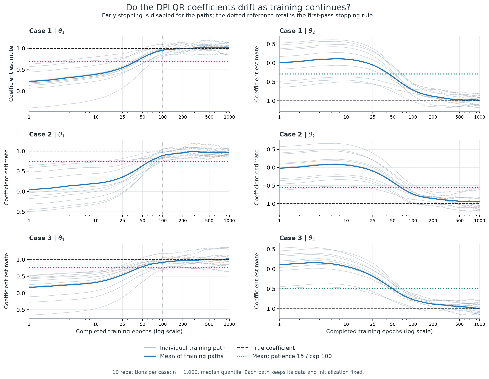
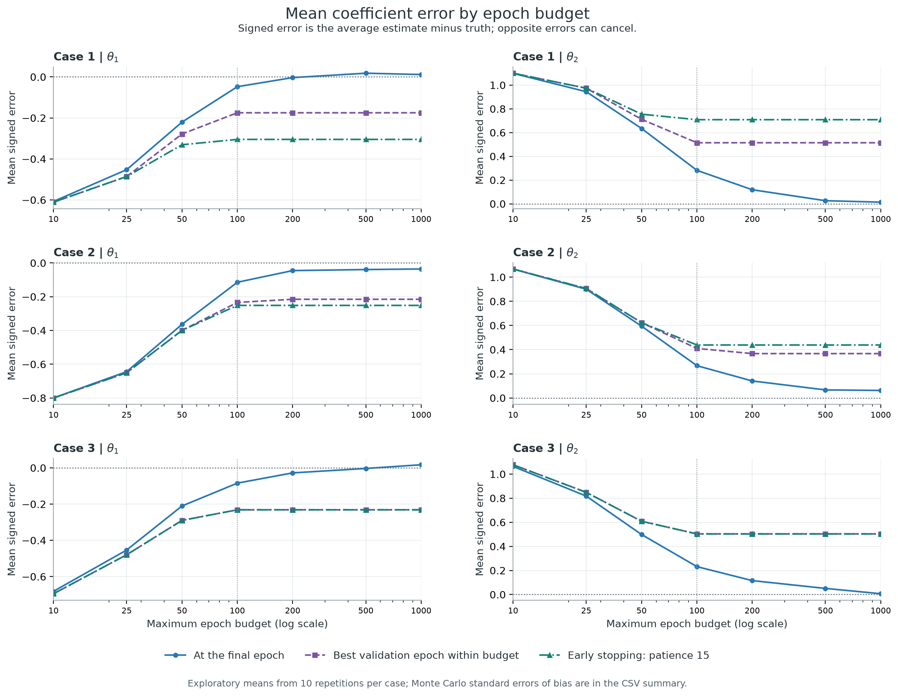
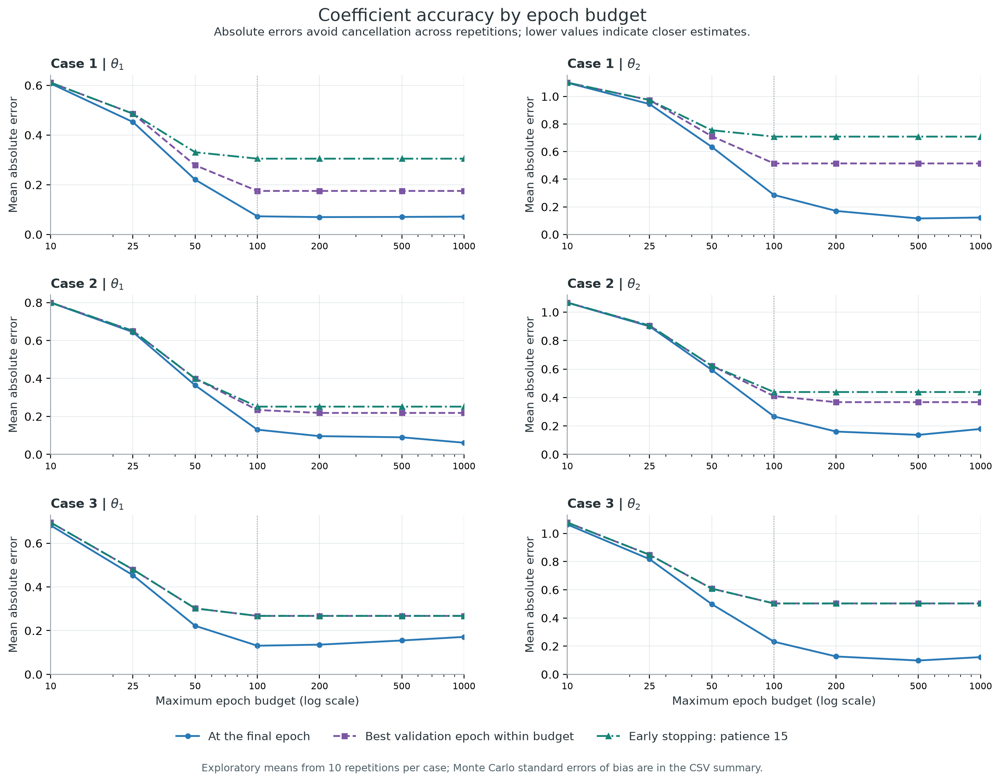
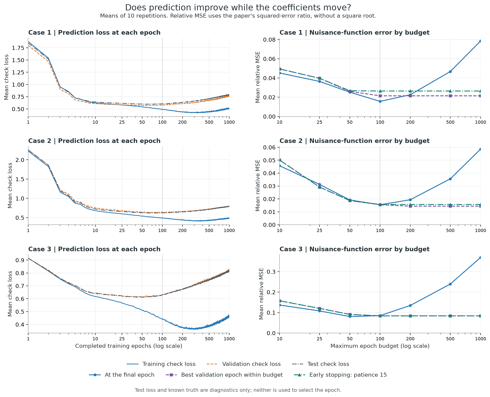

# DPLQR epoch experiment: ten repetitions per case

Created 08 September 2026 (08092026).

Completed **30 paired trajectories** through 1000 epochs: Cases 1–3, n=1000, tau=0.5, **10 repetitions per case**. The extension reuses 6 verified trajectories from the earlier two-repetition experiment and adds 24 new trajectories. The execution recorded 592.6 seconds for the run stage, including cache checks. The main first-pass notebook, full-replication settings, and earlier results remain unchanged.

## Findings

From terminal epoch 100 to 1000, absolute theta1 error increased in **15/30** datasets, absolute theta2 error increased in **5/30**, and test check loss increased in **30/30**. These compare continued training on the same data and starting weights. Smaller signed bias alone need not mean smaller individual errors.

- Case 1: theta1 bias -0.0477 → 0.0116; mean absolute theta1 error 0.0729 → 0.0714; absolute theta1 error increases in 6/10 datasets. Theta2 bias 0.2819 → 0.0137; mean absolute theta2 error 0.2860 → 0.1225.
- Case 2: theta1 bias -0.1145 → -0.0357; mean absolute theta1 error 0.1301 → 0.0613; absolute theta1 error increases in 2/10 datasets. Theta2 bias 0.2669 → 0.0621; mean absolute theta2 error 0.2669 → 0.1788.
- Case 3: theta1 bias -0.0844 → 0.0171; mean absolute theta1 error 0.1309 → 0.1712; absolute theta1 error increases in 7/10 datasets. Theta2 bias 0.2315 → 0.0067; mean absolute theta2 error 0.2315 → 0.1222.

With patience-15 stopping, the selected epoch is unchanged between caps 100 and 1000 in **30/30** datasets. Raising the maximum cap therefore has a different effect from forcing training to continue. Stable selection does not itself establish accurate coefficients.

## How much did the two-repetition estimate change?

The table compares terminal-epoch signed bias in the original two repetitions with the expanded ten repetitions. The ten include the original two; these are nested summaries, not independent experiments.

| Case | Terminal epoch | theta1 bias: 2 reps | theta1 bias: 10 reps | theta2 bias: 2 reps | theta2 bias: 10 reps |
| --- | --- | --- | --- | --- | --- |
| 1 | 100 | -0.0981 | -0.0477 | 0.3154 | 0.2819 |
| 1 | 1000 | -0.0853 | 0.0116 | 0.0337 | 0.0137 |
| 2 | 100 | -0.1657 | -0.1145 | 0.2938 | 0.2669 |
| 2 | 1000 | -0.0078 | -0.0357 | 0.1029 | 0.0621 |
| 3 | 100 | 0.0529 | -0.0844 | 0.2412 | 0.2315 |
| 3 | 1000 | 0.1695 | 0.0171 | 0.0131 | 0.0067 |

## Figures

## Selected budgets: bias, sample SD, and absolute error

| Case | Rule | Epoch cap | theta1 bias (SD) | theta1 MAE | theta2 bias (SD) | theta2 MAE | Nuisance relative MSE |
| --- | --- | --- | --- | --- | --- | --- | --- |
| 1 | Terminal epoch | 100 | -0.0477 (0.0865) | 0.0729 | 0.2819 (0.1529) | 0.2860 | 0.0157 |
| 1 | Terminal epoch | 500 | 0.0180 (0.0919) | 0.0704 | 0.0262 (0.1420) | 0.1155 | 0.0467 |
| 1 | Terminal epoch | 1000 | 0.0116 (0.0942) | 0.0714 | 0.0137 (0.1399) | 0.1225 | 0.0785 |
| 1 | Validation best | 100 | -0.1750 (0.1499) | 0.1750 | 0.5143 (0.3078) | 0.5143 | 0.0215 |
| 1 | Validation best | 500 | -0.1750 (0.1499) | 0.1750 | 0.5143 (0.3078) | 0.5143 | 0.0215 |
| 1 | Validation best | 1000 | -0.1750 (0.1499) | 0.1750 | 0.5143 (0.3078) | 0.5143 | 0.0215 |
| 1 | Patience 15 | 100 | -0.3049 (0.1685) | 0.3049 | 0.7086 (0.2219) | 0.7086 | 0.0265 |
| 1 | Patience 15 | 500 | -0.3049 (0.1685) | 0.3049 | 0.7086 (0.2219) | 0.7086 | 0.0265 |
| 1 | Patience 15 | 1000 | -0.3049 (0.1685) | 0.3049 | 0.7086 (0.2219) | 0.7086 | 0.0265 |
| 2 | Terminal epoch | 100 | -0.1145 (0.1079) | 0.1301 | 0.2669 (0.1699) | 0.2669 | 0.0155 |
| 2 | Terminal epoch | 500 | -0.0391 (0.1051) | 0.0900 | 0.0666 (0.1710) | 0.1370 | 0.0356 |
| 2 | Terminal epoch | 1000 | -0.0357 (0.0674) | 0.0613 | 0.0621 (0.2223) | 0.1788 | 0.0586 |
| 2 | Validation best | 100 | -0.2339 (0.1504) | 0.2339 | 0.4097 (0.1886) | 0.4097 | 0.0155 |
| 2 | Validation best | 500 | -0.2153 (0.1645) | 0.2184 | 0.3672 (0.1715) | 0.3672 | 0.0144 |
| 2 | Validation best | 1000 | -0.2153 (0.1645) | 0.2184 | 0.3672 (0.1715) | 0.3672 | 0.0144 |
| 2 | Patience 15 | 100 | -0.2516 (0.1614) | 0.2516 | 0.4383 (0.1953) | 0.4383 | 0.0157 |
| 2 | Patience 15 | 500 | -0.2516 (0.1614) | 0.2516 | 0.4383 (0.1953) | 0.4383 | 0.0157 |
| 2 | Patience 15 | 1000 | -0.2516 (0.1614) | 0.2516 | 0.4383 (0.1953) | 0.4383 | 0.0157 |
| 3 | Terminal epoch | 100 | -0.0844 (0.1529) | 0.1309 | 0.2315 (0.1280) | 0.2315 | 0.0850 |
| 3 | Terminal epoch | 500 | -0.0035 (0.2011) | 0.1549 | 0.0508 (0.1094) | 0.0981 | 0.2395 |
| 3 | Terminal epoch | 1000 | 0.0171 (0.2223) | 0.1712 | 0.0067 (0.1374) | 0.1222 | 0.3690 |
| 3 | Validation best | 100 | -0.2316 (0.2337) | 0.2673 | 0.5033 (0.2217) | 0.5033 | 0.0839 |
| 3 | Validation best | 500 | -0.2316 (0.2337) | 0.2673 | 0.5033 (0.2217) | 0.5033 | 0.0839 |
| 3 | Validation best | 1000 | -0.2316 (0.2337) | 0.2673 | 0.5033 (0.2217) | 0.5033 | 0.0839 |
| 3 | Patience 15 | 100 | -0.2316 (0.2337) | 0.2673 | 0.5033 (0.2217) | 0.5033 | 0.0839 |
| 3 | Patience 15 | 500 | -0.2316 (0.2337) | 0.2673 | 0.5033 (0.2217) | 0.5033 | 0.0839 |
| 3 | Patience 15 | 1000 | -0.2316 (0.2337) | 0.2673 | 0.5033 (0.2217) | 0.5033 | 0.0839 |

True theta=(1,-1). Signed bias is the mean estimate minus truth, SD is the sample standard deviation across repetitions, and MAE is the mean absolute coefficient error. Nuisance relative MSE is the paper’s squared-error ratio, without a square root. The first-pass fitting rule is Patience 15 / cap 100.

## Monte Carlo uncertainty and limits

Ten repetitions provide a broader diagnostic than two, but are still a small Monte Carlo sample. The CSV summary includes a Monte Carlo standard error for each bias estimate (sample SD divided by the square root of 10). The paired-drift summary reports the mean change in absolute error with its Monte Carlo standard error, retaining pairing across epochs. These describe simulation variability, not model-based coefficient standard errors or coverage probabilities. Individual paths remain useful because signed errors can cancel, and the three cases should not be pooled as one common data-generating model.

This study holds depth=2, width=32, learning rate=0.005, batch size=128, n=1000, tau=0.5, and the training/validation split fixed. Each repetition uses a fresh dataset and its own initialization; it does not separate sampling variability from initialization variability. The duration comparison is paired within each repetition. True coefficients and test results are used only for diagnostics; validation loss selects checkpoints. The 1000-epoch terminal branch deliberately continues beyond early stopping. A full 200-repetition experiment with paper tuning remains separate. No auxiliary projection fits, coefficient SEs, coverage, or R stage are included.

## Reproduction checks and files

- The 6 reused trajectories retain the original epoch diagnostics after provenance checks.
- All 6 existing cap-100/patience-15 baseline fits are checked against the saved first-pass coefficients, nuisance errors, prediction losses, and stopping epochs.
- New repetitions use the same original data generator and deterministic seed sequence; they have no pre-existing first-pass CSV against which to claim baseline reproduction.
- The training observer checks that it leaves Torch RNG unchanged and clips only an evaluation clone.
- [Source notebook](epoch_robustness.ipynb) / [executed notebook](executed_epoch_robustness.ipynb).
- [Epoch paths](epoch_trajectories.csv), [budget results](epoch_budget_results.csv), [summary with Monte Carlo SE](epoch_summary.csv), [bias and SD](coefficient_bias_sd_by_epoch.csv).
- [Paired changes](paired_drift_100_to_final.csv), [paired-drift summary](paired_drift_summary.csv), [baseline checks](baseline_reproduction_checks.csv), [configuration](epoch_run_config.json).
- Four figures are saved in PNG and vector PDF format in `figures/`.
