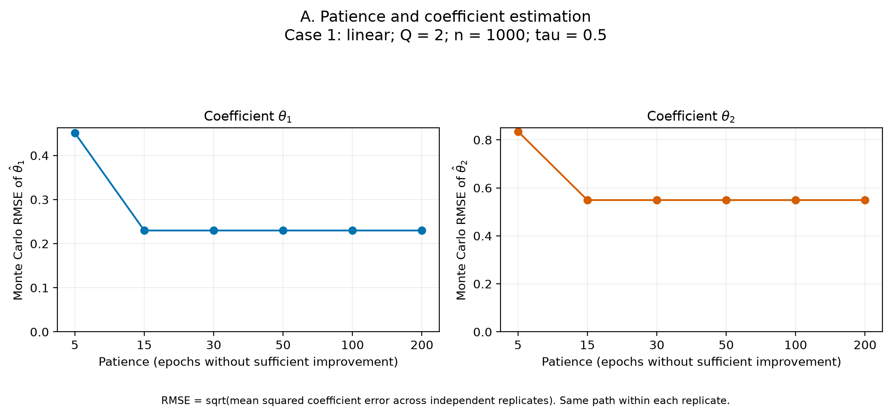
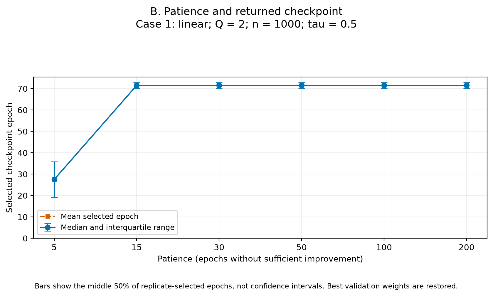
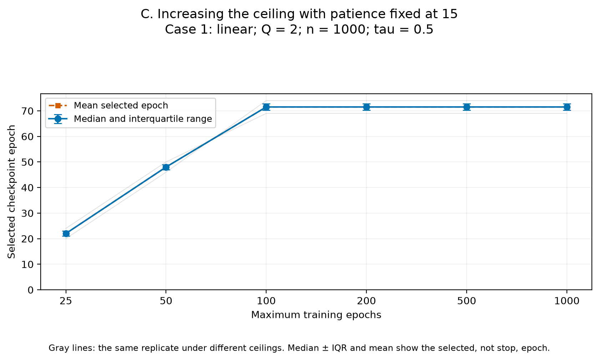
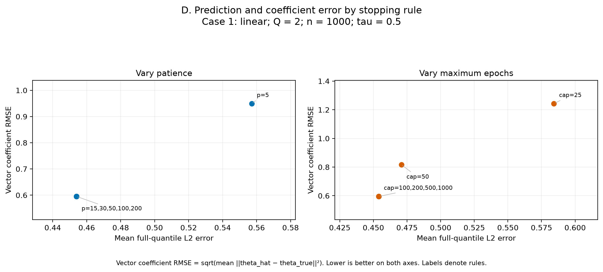
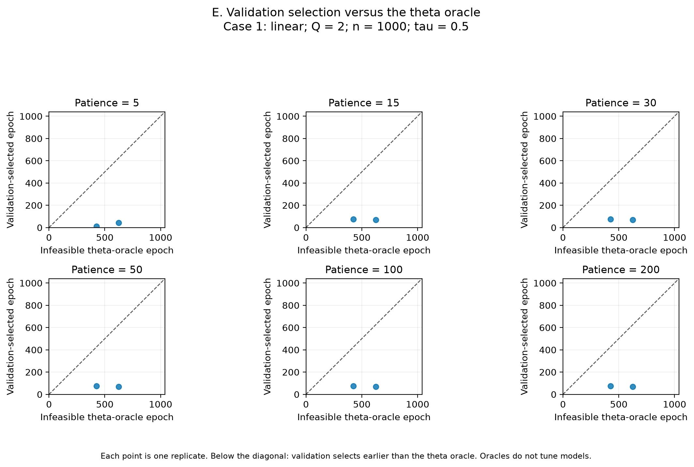

# Validation early stopping versus theta estimation

This experiment applies all stopping rules to the same continuous optimization path within each replicate. Only the stopping rule changes. The theta, prediction, nuisance and test-loss oracles are infeasible evaluation benchmarks and never determine the practical stopping rule.

Completed analysis: **Case 1: 2 replicates**; n = 1000, tau = 0.5, common full-path ceiling = 1000. There are 26 selected-rule rows. Only these completed replicates support the summaries.

These are pilot Monte Carlo results. Replicate-level SD, MCSE and IQR are descriptive with this sample size. This study evaluates coefficient estimation, not confidence-interval coverage or the validity of inferential procedures.

## Practical rule and oracle alignment

The main rule restores the best validation weights. Its returned checkpoint (`selected_epoch`) can therefore precede the epoch at which training terminates (`stop_epoch`). The stopping decision uses only training-epoch order and validation check loss, with the repository's min_delta and patience convention recorded in run_config.json. Test loss and true functions are evaluation only.

The repository's actual validation criterion averages batch check-loss means with equal batch weights. With 200 validation observations and batch size 128, that gives equal weight to the 128-observation and 72-observation batch means. It differs from the empirical mean over all 200 observations. `validation_check_loss` records this actual stopping criterion; `empirical_validation_check_loss` separately preserves the full-sample diagnostic. The first checkpoint attaining the qualifying best validation loss is retained when later epochs tie it; the configured improvement and patience-counting convention is preserved.

The following table fixes patience at 15 and the common full-path ceiling. A negative epoch gap means validation selects earlier than the coefficient oracle.

| Case | Mean selected | Mean stop | Mean theta oracle | Mean gap | Within ±25 | Mean theta regret |
| --- | --- | --- | --- | --- | --- | --- |
| 1 | 71.5 | 86.5 | 525.0 | -453.5 | 0% | 0.426 |

Case 1: validation selects before the theta oracle in 100% of replicates, exactly at it in 0%, and after it in 0%. The mean absolute epoch gap is 453.5 epochs. A distant epoch is not by itself a large estimation loss; the regret quantifies the actual increase in coefficient error relative to the oracle.

## Coefficient and prediction performance

| Case | Patience | Theta 1 bias | Theta 1 RMSE | Theta 2 bias | Theta 2 RMSE | Vector RMSE | q L2 | Test loss |
| --- | --- | --- | --- | --- | --- | --- | --- | --- |
| 1 | 5 | -0.402 | 0.451 | 0.782 | 0.835 | 0.949 | 0.557 | 0.609 |
| 1 | 15 | -0.159 | 0.230 | 0.489 | 0.549 | 0.595 | 0.454 | 0.590 |
| 1 | 30 | -0.159 | 0.230 | 0.489 | 0.549 | 0.595 | 0.454 | 0.590 |
| 1 | 50 | -0.159 | 0.230 | 0.489 | 0.549 | 0.595 | 0.454 | 0.590 |
| 1 | 100 | -0.159 | 0.230 | 0.489 | 0.549 | 0.595 | 0.454 | 0.590 |
| 1 | 200 | -0.159 | 0.230 | 0.489 | 0.549 | 0.595 | 0.454 | 0.590 |

Component RMSE is sqrt(mean squared signed coefficient error). Vector RMSE is sqrt(mean squared Euclidean coefficient error); it differs from the mean Euclidean error, which is also saved. SD uses ddof = 1 across replicates. The q and m errors are absolute L2 errors on the fixed independent evaluation sample, not relative MSE.

## When does a higher epoch ceiling stop changing the estimator?

Each row below compares the given ceiling with the largest ceiling on the same replicate, with patience fixed at 15. Identical selected epochs refer to exactly the same checkpoint.

| Case | Cap | Reference cap | Same selected checkpoint | Largest coefficient difference (L2) |
| --- | --- | --- | --- | --- |
| 1 | 25 | 1000 | 0/2 | 0.910117 |
| 1 | 50 | 1000 | 0/2 | 0.313364 |
| 1 | 100 | 1000 | 2/2 | 0.000000 |
| 1 | 200 | 1000 | 2/2 | 0.000000 |
| 1 | 500 | 1000 | 2/2 | 0.000000 |
| 1 | 1000 | 1000 | 2/2 | 0.000000 |

Case 1: among the tested ceilings, every replicate matches the largest-ceiling selected checkpoint from cap 100 onward. This is a statement about this run and the tested caps, not a guarantee for new datasets.

## Distinguishing the scientific patterns

1. **Ordinary prediction overfitting:** later training lowers training loss while validation/test loss and coefficient error rise.
2. **Prediction–coefficient tension:** prediction remains good or improves while coefficient error rises. This shows that a prediction criterion need not optimize theta estimation.
3. **Early stopping protects both:** the selected epoch is close to the theta oracle and later training worsens both prediction and coefficient error.

These patterns can coexist within a case or differ across replicates. They are not exhaustive and the results are not assigned to a pattern by assumption.

For a concrete paired comparison, the table below follows each patience-15 selected checkpoint to epoch 1000 on that same path. These are endpoint comparisons and do not imply monotonic change at every intervening epoch.

| Case | Q | Train↓, val↑, test↑, theta↑ | Val/test/q no worse, theta↑ | Within ±25 then theta/test/q↑ |
| --- | --- | --- | --- | --- |
| 1 | 2 | 0 | 0 | 0 |

Arrows are literal directional comparisons. 'No worse' means a nonpositive measured change in every listed metric; no data-dependent tolerance for 'stable' is introduced. The ±25 epoch window is a prespecified descriptive proximity summary, not an optimality test. These counts illustrate the three possible patterns without treating an endpoint sign as proof of a mechanism.

Case 1, selected → 1000: mean coefficient L2 error 0.523 → 0.148; mean q L2 error 0.454 → 1.444; mean test loss 0.590 → 0.809.

The infeasible theta oracle minimizes error over all recorded epochs of the full path. Its advantage is optimistic by construction and cannot be achieved by consulting unknown theta in real data. A positive oracle regret demonstrates a gap to that benchmark; it alone does not prove early stopping is ineffective, nor does good quantile prediction establish valid theta inference.

## Figures

Each case has separate PNG and vector PDF versions. Epoch bars are replicate IQRs. There are no confidence bands on RMSE curves.

### Case 1

A. Patience versus component RMSE

[Vector PDF](figures/case_1_A_patience_theta_rmse.pdf)

B. Patience versus selected epoch

[Vector PDF](figures/case_1_B_patience_selected_epoch.pdf)

C. Maximum epochs versus selected epoch

[Vector PDF](figures/case_1_C_cap_selected_epoch.pdf)

D. Quantile prediction error versus vector coefficient RMSE

[Vector PDF](figures/case_1_D_prediction_theta_error.pdf)

E. Selected epoch versus the theta oracle, by patience

[Vector PDF](figures/case_1_E_selected_theta_oracle.pdf)

## Machine-readable outputs

- [Selected-rule estimates and stopping decisions](early_stopping_results.csv)
- [Patience Monte Carlo summaries](monte_carlo_summary_patience.csv)
- [Maximum-epoch Monte Carlo summaries](monte_carlo_summary_max_epochs.csv)
- [Oracle epoch summaries](oracle_epoch_summary.csv)
- [Per-replicate oracle diagnostics](oracle_epochs.csv)
- [Paired ceiling comparisons](paired_max_epoch_comparisons.csv)
- [Selected-to-ceiling directional comparisons](selected_to_ceiling_comparisons.csv)
- [Run configuration and provenance](run_config.json)
