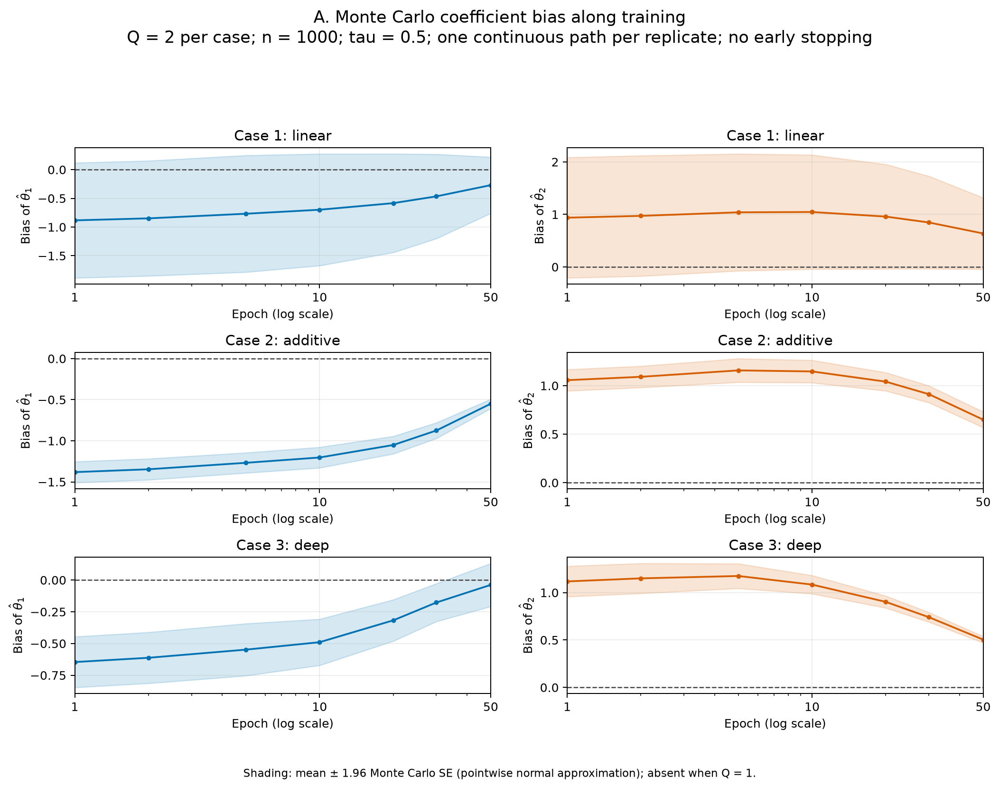
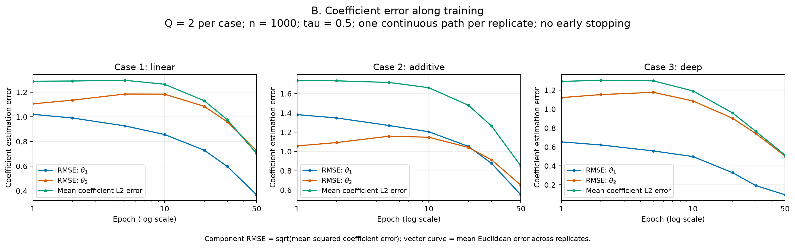
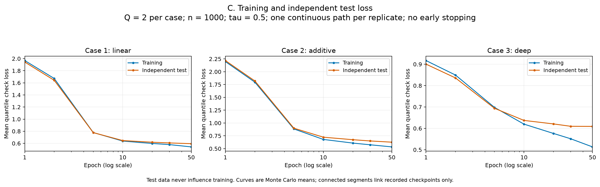
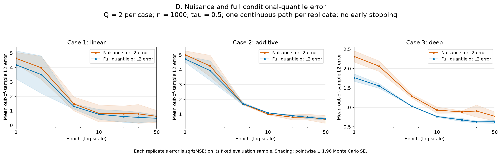
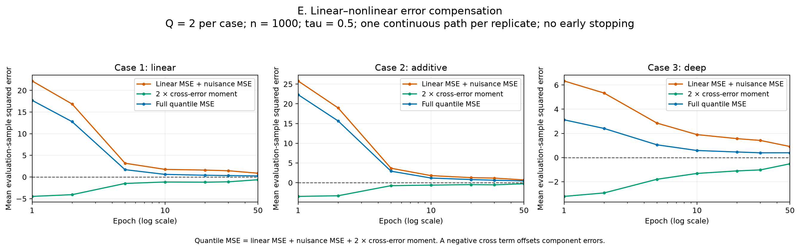
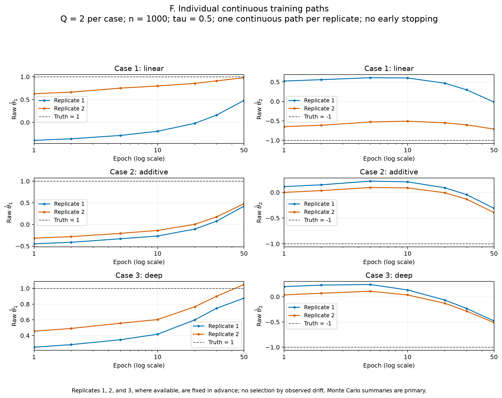

# Continued-training diagnostic results

These results follow one initialized DPLQR model continuously on one training dataset per replicate. Training uses the fixed epoch ceiling, with no early stopping, no best-validation weight restoration, and no checkpoint selection. Validation, test and evaluation data do not affect optimization.

Completed data: **Case 1: 2 repetitions; Case 2: 2 repetitions; Case 3: 2 repetitions**; n = 1000; tau = 0.5; training/validation sizes = 800/200; independent test size = 10000; independent evaluation size = 10000.

Recorded epochs: 1, 2, 5, 10, 20, 30, 50. There are 42 checkpoint rows and 6 distinct case–replicate trajectories.

**This is a reduced run. The intended design is 100 repetitions per case; the current run does not complete that design.** Small-run differences and Monte Carlo uncertainty intervals are exploratory.

## Paired endpoint comparisons

The following comparisons use epoch **1 → 50** on the same replicate. Changes are end minus start. The coefficient diagnostic is the Euclidean error `||theta_hat - theta_true||_2`; it is not the absolute value of average bias.

### Coefficient L2 error

| Case | Mean at 1 | Mean at 50 | Mean paired change | MCSE of change | Approx. MC interval |
| --- | --- | --- | --- | --- | --- |
| Case 1 | 1.2887 | 0.7024 | -0.5864 | 0.3656 | [-1.3029, 0.1302] |
| Case 2 | 1.7389 | 0.8511 | -0.8879 | 0.0358 | [-0.9580, -0.8177] |
| Case 3 | 1.2921 | 0.5133 | -0.7788 | 0.0987 | [-0.9721, -0.5854] |

### Training check loss

| Case | Mean at 1 | Mean at 50 | Mean paired change | MCSE of change | Approx. MC interval |
| --- | --- | --- | --- | --- | --- |
| Case 1 | 1.9685 | 0.5413 | -1.4273 | 0.2508 | [-1.9188, -0.9357] |
| Case 2 | 2.1983 | 0.5341 | -1.6642 | 0.0070 | [-1.6778, -1.6505] |
| Case 3 | 0.9173 | 0.5133 | -0.4039 | 0.0005 | [-0.4048, -0.4030] |

### Independent test check loss

| Case | Mean at 1 | Mean at 50 | Mean paired change | MCSE of change | Approx. MC interval |
| --- | --- | --- | --- | --- | --- |
| Case 1 | 1.9439 | 0.5946 | -1.3493 | 0.2560 | [-1.8510, -0.8476] |
| Case 2 | 2.2182 | 0.6262 | -1.5920 | 0.0493 | [-1.6885, -1.4954] |
| Case 3 | 0.9006 | 0.6092 | -0.2914 | 0.0203 | [-0.3312, -0.2516] |

### Nuisance L2 error

| Case | Mean at 1 | Mean at 50 | Mean paired change | MCSE of change | Approx. MC interval |
| --- | --- | --- | --- | --- | --- |
| Case 1 | 4.6247 | 0.6167 | -4.0080 | 0.4230 | [-4.8370, -3.1789] |
| Case 2 | 5.0129 | 0.6409 | -4.3719 | 0.0031 | [-4.3780, -4.3659] |
| Case 3 | 2.3121 | 0.7690 | -1.5431 | 0.1325 | [-1.8028, -1.2835] |

### Full conditional-quantile L2 error

| Case | Mean at 1 | Mean at 50 | Mean paired change | MCSE of change | Approx. MC interval |
| --- | --- | --- | --- | --- | --- |
| Case 1 | 4.1788 | 0.4810 | -3.6979 | 0.6098 | [-4.8931, -2.5026] |
| Case 2 | 4.7245 | 0.6746 | -4.0499 | 0.0827 | [-4.2120, -3.8878] |
| Case 3 | 1.7665 | 0.6287 | -1.1378 | 0.0694 | [-1.2738, -1.0019] |

The intervals are mean paired change ± 1.96 × its Monte Carlo SE, treating a replicate as the independent unit. They are pointwise normal approximations, not simultaneous intervals or tests adjusted for looking across cases, coefficients and epochs. In small runs they can be unreliable. Evaluation-sample approximation error is also part of each replicate's measurement.

### Counts of paired directional changes

| Case | Q | Train loss ↓ | Theta L2 ↑ | q L2 ↓ | Test loss ↑ | Train ↓, theta ↑, q ↓ | Train ↓, theta ↑, test ↑ |
| --- | --- | --- | --- | --- | --- | --- | --- |
| Case 1 | 2 | 2 | 0 | 2 | 0 | 0 | 0 |
| Case 2 | 2 | 2 | 0 | 2 | 0 | 0 | 0 |
| Case 3 | 2 | 2 | 0 | 2 | 0 | 0 | 0 |

These are literal strict directional comparisons of finite-sample estimates, without a post hoc threshold for 'roughly stable'. Counts alone do not establish a population effect. A lower q error with a worse coefficient estimate is compatible with compensation by the nuisance network; a negative cross-error moment directly describes cancellation on the evaluation sample. Neither observation alone establishes a causal or asymptotic mechanism. Worsening test loss alongside lower training loss is evidence compatible with ordinary prediction overfitting, which can coexist with compensation.

## Coefficient bias and RMSE

| Case | Component | Epoch | Mean estimate | Truth | Bias | SD | RMSE |
| --- | --- | --- | --- | --- | --- | --- | --- |
| 1 | theta_1 | 1 | 0.1169 | 1.0000 | -0.8831 | 0.7237 | 1.0206 |
| 1 | theta_2 | 1 | -0.0621 | -1.0000 | 0.9379 | 0.8275 | 1.1055 |
| 1 | theta_1 | 50 | 0.7299 | 1.0000 | -0.2701 | 0.3532 | 0.3679 |
| 1 | theta_2 | 50 | -0.3624 | -1.0000 | 0.6376 | 0.4905 | 0.7258 |
| 2 | theta_1 | 1 | -0.3813 | 1.0000 | -1.3813 | 0.0927 | 1.3828 |
| 2 | theta_2 | 1 | 0.0564 | -1.0000 | 1.0564 | 0.0795 | 1.0579 |
| 2 | theta_1 | 50 | 0.4502 | 1.0000 | -0.5498 | 0.0412 | 0.5506 |
| 2 | theta_2 | 50 | -0.3504 | -1.0000 | 0.6496 | 0.0585 | 0.6510 |
| 3 | theta_1 | 1 | 0.3540 | 1.0000 | -0.6460 | 0.1444 | 0.6540 |
| 3 | theta_2 | 1 | 0.1180 | -1.0000 | 1.1180 | 0.1159 | 1.1210 |
| 3 | theta_1 | 50 | 0.9619 | 1.0000 | -0.0381 | 0.1225 | 0.0946 |
| 3 | theta_2 | 50 | -0.4953 | -1.0000 | 0.5047 | 0.0243 | 0.5050 |

Bias is the mean signed coefficient error. SD uses the sample standard deviation across replicates (ddof = 1). RMSE is sqrt(mean squared coefficient error). Small bias can coexist with large SD or RMSE because positive and negative errors cancel across replicates.

## Figures

A. Mean signed coefficient error; zero denotes no bias.

[PDF version](figures/A_theta_bias.pdf)

B. Component RMSE and mean vector coefficient L2 error.

[PDF version](figures/B_theta_error.pdf)

C. Training and genuinely independent test check loss.

[PDF version](figures/C_check_loss.pdf)

D. Nuisance and full quantile L2 error on fixed evaluation samples.

[PDF version](figures/D_nuisance_and_quantile_error.pdf)

E. Squared-error decomposition and cancellation between linear and nonlinear errors.

[PDF version](figures/E_error_decomposition.pdf)

F. Raw coefficient paths for pre-specified replicates 1–3, where available.

[PDF version](figures/F_fixed_replicate_paths.pdf)

## Definitions and reproducibility

The nuisance and full-quantile L2 diagnostics are square roots of empirical mean squared errors against the known true functions on a fixed independent evaluation sample within each replicate. They are **not** the relative mean squared error used in the older paper-table replication output. The nuisance truth includes the error-distribution quantile shift when tau differs from 0.5. All reported network values are evaluated directly without post hoc coefficient clipping or nuisance recalibration.

The decomposition is `q_mse = linear_error_mse + nonlinear_error_mse + 2 * cross_error_moment`. The raw `cancellation_fraction` is `-2 * cross_error_moment / (linear_error_mse + nonlinear_error_mse)` (zero if the denominator is zero); a positive value indicates error cancellation. The maximum absolute recorded decomposition residual is 3.55e-15.

Per-replicate data, initialization, shuffle/training, test and evaluation seeds are retained in the raw CSV. Optimizer-step counts, model-instance identifiers and fit-call counts are also retained to audit the continuous paths. Consult the run configuration and execution validation record for the architecture, optimizer, ceiling and checks actually used.

- [Raw checkpoint trajectories](raw_epoch_trajectory.csv)
- [Tidy coefficient summaries](monte_carlo_summary.csv)
- [Tidy diagnostic summaries](diagnostic_summary.csv)
- [Paired endpoint changes and Monte Carlo uncertainty](paired_endpoint_changes.csv)
- [Paired directional counts](endpoint_pattern_counts.csv)
- [Run configuration](run_config.json)
